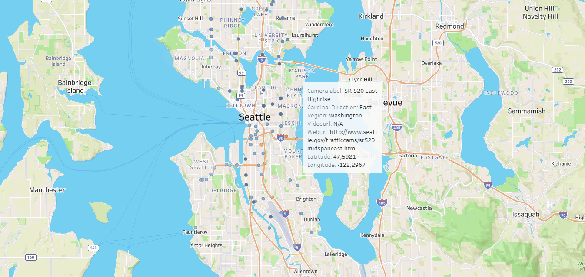
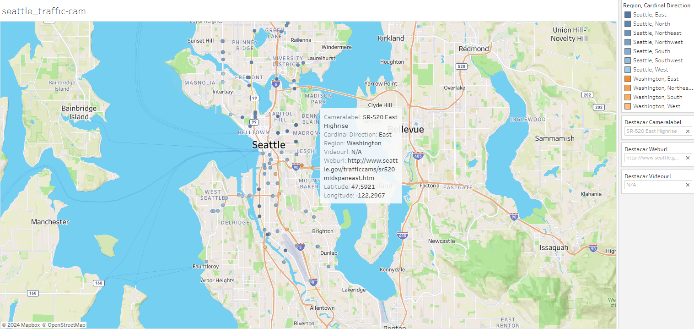
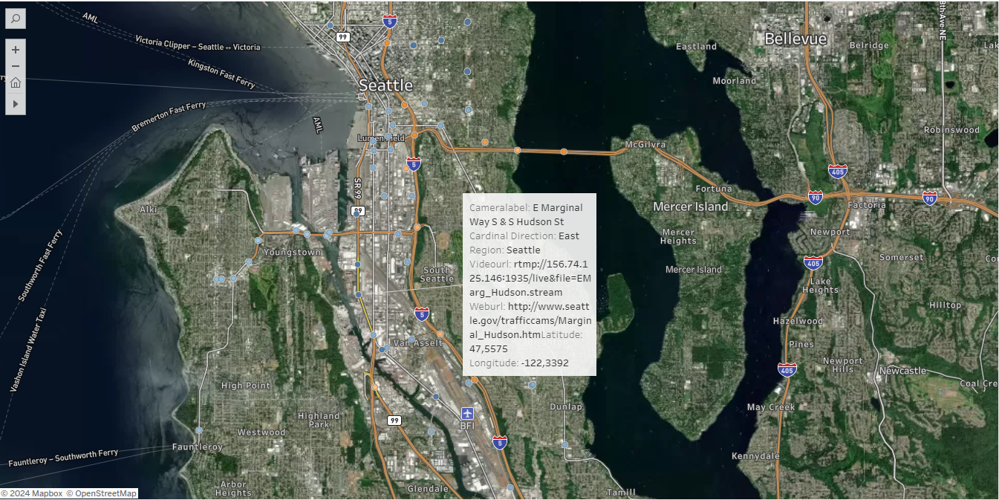

# Limpeza e análise de dados de câmeras de trânsito de Seattle

## Visão Geral do Projeto

Este script Python tem como objetivo limpar e analisar um conjunto de dados contendo informações sobre câmeras de trânsito em Seattle. O conjunto de dados é obtido do Kaggle e inclui detalhes como propriedade da câmera, rótulos, URLs de imagens e vídeos e regiões geográficas.

## Configurar

- `VIGILATION_API`: Uma string vazia para potencial uso futuro.
- `metadata_json`: Caminho para o arquivo JSON de metadados.
- Bibliotecas possíveis: pandas, matplotlib, seaborn, json_normalize, re e Imagem do módulo PIL.
- Instalação do pacote adicional: O pacote Kaggle é instalado usando `!pip install kaggle`.
- Credenciais Kaggle: O usuário carrega o arquivo de chave da API Kaggle (`kaggle.json`) e o script configura as permissões permitidas.

## Download e pré-processamento de dados

- Baixe o conjunto de dados "seattle-traffic-cameras" do Kaggle e o extrai.
- Importar o conjunto de dados para um Pandas DataFrame (`df`).
- Executar uma análise exploratória inicial, exibindo informações como formato dos dados, nomes de colunas, tipos de dados e porcentagens de valores nulos.

## Limpeza de dados

- Lida com valores ausentes em 'VIDEOURL' e 'WEBURL' preenchendo-os com 'N/A'.
- Extrai cartões específicos da coluna 'CAMERALABEL', criando uma nova coluna 'CARDINAL_DIRECTION'.
- Renomeia 'XPOS' e 'YPOS' para 'LONGITUDE' e 'LATITUDE' respectivamente.
- Extrai URLs da coluna 'IMAGEURL'.
- Crie uma nova coluna 'REGION' com base nos valores da coluna 'OWNERSHIPCD'.

## Visualizações

- Gera gráficos de barras para visualizar a distribuição dos departamentos de propriedade ('OWNERSHIPCD') e a frequência dos pontos cardeais ('CARDINAL_DIRECTION').
- Visualizações:
- 
- 

## Exibição de imagem

- Use a biblioteca PIL para exibir imagens de caminhos especificados.

## Conclusão

Este script fornece uma visão geral abrangente do processo de limpeza e análise de dados para o conjunto de dados de câmeras de trânsito de Seattle. O DataFrame resultante (`df_pos`) está pronto para maior exploração e insights sobre padrões de câmeras de trânsito em Seattle.
