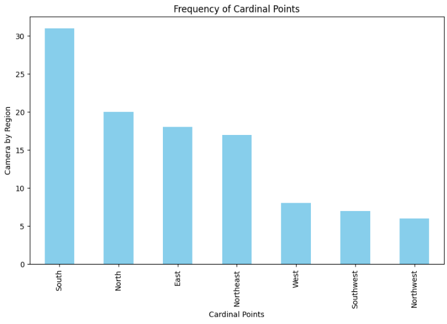
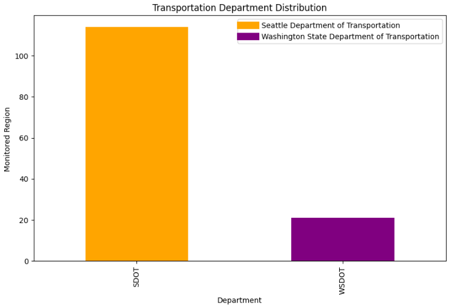

# Análise de dados de câmeras de trânsito de Seattle

## Visão Geral do Projeto
O Departamento de Transporte de Seattle tornou publico uma amostra de seus dados a respeito da distribuição de cameras pelas avenidas e vias de circulação de Seattle, apartir desses dados, foi considerado a tarefa de limpeza e extração de strings por meio de expressões contidas dentro dos padrões Regex, de modo a trabalhar exibir a distribuição das cameras aos pontos cardiais de cada camera, apartir dessas informações tem-se a distribuição de cameras de vigilancia como valor, o que permite um maior entendimento sobre o território e a preocupação do Governo em monitorar essas áreas.

## Finalidade 
Esse projeto foi desenvolvido para aprendizado apenas, sinta-se á vontade para modifica-lo. Estou aberto para sugestões e também para novos olhares sob o meio trabalho, pois acredito que precisa melhorar bastante ainda ! 

## Bibliotecas Utilizadas

- matplotlib.pyplot: Responsável por exibir planos cartesianos 
- seaborn: Cria gráficos Estatísticos com diferentes estilos
- pandas: É uma biblioteca com inumeras funções as quais a Manipulação de Dados e a Consulta destes se destacam 
- re: Ela permite que você trabalhe com padrões de busca e correspondência em strings.
- PIL: Permite exibir imagens e alterar suas definições, como tamanho e ângulo. 

## Limpeza de dados e Tratamento

- Para Lidar com valores ausentes de modo conveniente e prudente na coluna 'VIDEOURL' e 'WEBURL' foi adotado o preenchimento com 'N/A' ao invés de outro método, pois pensando em questões de tomada de decisão e valores da informação seria um risco apagar os dados que eram NAN sendo esses dignos de insights.
- Uma metrica que foi extraida dos dados foram as coordenadas cardeais(Norte,Sul,Leste,Oeste,Nordeste) dentro da coluna 'CAMERALABEL', a qual foi exibida em uma nova coluna 'CARDINAL_DIRECTION'.
- Para maior entendimento e manutenção para públicos resolvi mudar os nomes das colunas: 'XPOS' e 'YPOS' para 'LONGITUDE' e 'LATITUDE' respectivamente.

## Visualizações

Os resultados das extrações foram tais:
### Tableau Software:
 

### Matplotlib:
 
 
 

## Conclusão
É possível notar a preocupação do departamento de transporte de seattle em monitorar a região do sul, levando em conta os aspectos do território, tem-se que a maior distribuição de vias está concentrado na região sul e seattle. Devido as divisões entre as vias, o número de cameras de vigilância se faz mais necessário para uma maior gestão, Haja vista que por mais que a cidade de um modo geral é considerada segura, ainda há indices de crimes maiores concentrados justamente na região sul, segundo informações do site: https://crimegrade.org/safest-places-in-downtown-seattle-seattle-wa. Pertinente a isso, turistas e moradores devem ter maior cautela dentro dessas regiões.
